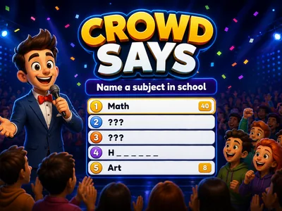
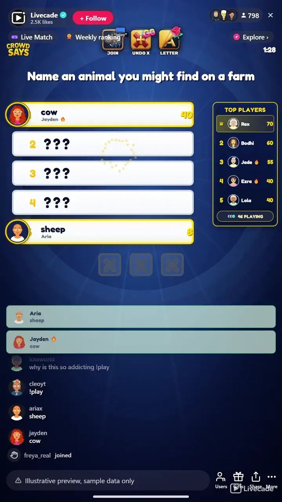

# Crowd Says - Interactive TikTok Live Game

> Five hidden answers, three strikes, and a whole chat guessing what everyone else would say.

A question with five ranked answers, and the whole chat shouting guesses at once. The top answer is worth the most, three strikes ends the round, and nobody has to know anything to play. Just say what you think most people would say.

**[Play Crowd Says on Livecade](https://livecade.io/games/crowd-says/?utm_source=github&utm_medium=readme&utm_campaign=crowd-says)** - runs as a single browser source in OBS, Streamlabs, or TikTok LIVE Studio. Nothing for viewers to install.

## How viewers play

Viewers take part with the actions TikTok already gives them: **comments**, **gifts**, **likes**, **follows**, **shares**. Every action below is rebindable, so you decide which interaction drives which effect.

| Action | What it does |
| --- | --- |
| **Answer the board** | Any comment is checked against the five hidden answers. A match flips the slot open, scores its points, and pins the guesser avatar to it |
| **Join the game** | Optional opt in gate. Leave it off and anyone who answers is playing, or bind it so only viewers who joined can score and spend strikes |
| **Extra strike** | A gift restores one lost strike, so a round that was one wrong answer from ending keeps going |
| **Reveal a letter** | A gift uncovers one letter of the cheapest hidden answer, shown to everyone as a partial word. The viewer whose gift completes it takes the slot and the points |

## How it works

### Guess what the crowd would say

The answers are not facts, they are the most common responses to the prompt. Nothing to look up and nothing to have watched, so a viewer who arrives mid round can guess on their very first comment.

### The top answer pays the most

Five answers sit ranked by points, and the board shows how much each slot is worth as it opens. Chasing the number one answer is worth more than sweeping the cheap ones.

### One troll cannot end the round

Three wrong answers ends a round, but any single viewer can only cause one of them. Their correct answers still score, and comments that are not really attempts are ignored instead of counted.

## About the game

Crowd Says is a survey game show where your chat is the contestant. Every round puts one prompt on the board, something like name a room in a house, with five answers hidden underneath and ranked by how many points they carry. Viewers type what they think into chat and the board flips open as they get them.

### Nobody has to know anything to play

The answers are not facts to know, they are guesses about what everyone else would say, so a viewer who just arrived is on equal footing with one who has watched all night. There is no buzzer and no turn order either, so a hundred people can guess the same second and the fastest right answer takes the slot, with the guesser avatar pinned to it for the rest of the round.

### One troll cannot burn the board down

Three wrong answers ends the round, but one viewer can only ever cause a single strike, and their correct answers still count. Comments that are clearly not attempts, a greeting or an emoji, are ignored rather than punished. Matching is forgiving on purpose: accents fold so a phone typed answer still lands, a small typo on a longer word is still accepted, and a multi word answer matches on its meaningful word, so walking on the beach is solved by typing beach.

### A bank written natively, not translated

The bank ships 2,620 boards and 13,100 answers across twelve languages, each one written natively rather than translated, because a survey is a poll of what people in that culture actually say. In the Arabic bank, name a pet puts cat above dog, the reverse of English. Every board is checked offline before it ships so an unwinnable one never appears live, and the question is read aloud in your own streaming voice so a viewer who is listening rather than watching can still play.

## What it looks like on stream

[Watch Crowd Says gameplay](https://cdn.livecade.io/games/crowd-says.mp4)

## What you can configure

- **Language** - Twelve languages, each with its own natively written board bank
- **Seconds per round** - Thirty seconds to five minutes before the board opens and moves on
- **Rounds per match** - Up to ten with a final podium, or endless
- **Lobby countdown** - An opening roll call so viewers can join, or skip straight into round one
- **Strikes allowed per round** - One to five wrong answers before the round ends
- **Max strikes from one viewer** - Caps how much damage a single person can do in a round
- **Seconds between answers per viewer** - A per viewer cooldown so one person cannot flood the board
- **Read the question aloud** - Speaks each prompt in your global streaming voice
- **Show who got each answer** - Pins the guesser avatar and name to the slot they solved
- **Name the viewer on each strike** - Off by default, so an ordinary wrong guess is not captioned with a face
- **Leaderboard and answer feed** - Who is winning, and what chat just tried
- **Background colour or image** - Or transparent, to sit over your camera
- **Your survey bank** - Write your own boards, or hide and restore any of ours from the content manager

## Languages

English, Spanish, Portuguese, French, German, Italian, Indonesian, Arabic, Turkish, Russian, Hindi, Romanian

## FAQ

<strong>How do viewers play Crowd Says?</strong>

They type an answer in chat. Each round shows one prompt with five hidden answers ranked by points, and a correct guess flips its slot open and credits the viewer. There is no turn order, so everyone guesses at once and the first correct answer takes the slot.

<strong>Do viewers need to know the answers?</strong>

No, and that is the point. The answers are the most common responses to the prompt, not facts, so playing well means guessing what other people would say. Someone who just joined your stream can be right on their first comment.

<strong>Can one person ruin the round by answering badly?</strong>

No. Three wrong answers ends a round, but any single viewer can only ever cause one strike, and their correct answers still score afterwards. You can also turn on an opt in gate so only viewers who joined can affect the board at all.

<strong>What if a viewer makes a typo?</strong>

It usually still counts. Accents fold so a phone typed answer matches, a small typo on a longer word is accepted, and a multi word answer can be solved by typing its meaningful word, so walking on the beach matches beach.

<strong>What do gifts do?</strong>

One gift restores a lost strike so a round that was about to end continues. The other buys a single letter of the cheapest hidden answer, revealed to everyone as a partial word, so it gives the whole crowd a clue instead of handing one buyer the answer. Whoever completes the word takes the points.

<strong>How many questions are there?</strong>

Over two and a half thousand boards and thirteen thousand answers across twelve languages. Each language is written natively rather than translated, because the answer ranking differs by culture, and every board is checked before it ships so an unwinnable one never reaches your stream.

<strong>Are the points real survey results?</strong>

No. They are a plausible ranking that makes the board fun to play, not data from a conducted survey, so the game never claims a number of people were polled.

<strong>How do I add Crowd Says to my TikTok Live?</strong>

Add one browser source URL to OBS or your streaming software and go live. There is no plugin to install and nothing for your viewers to download.

## Setup

1. [Create a Livecade account](https://app.livecade.io/register?utm_source=github&utm_medium=cta&utm_campaign=crowd-says)
2. Copy your overlay browser source URL
3. Paste it into OBS, Streamlabs, or TikTok LIVE Studio
4. Pick Crowd Says, set your triggers, and go live

Runs in the browser, so it works on Windows and macOS with nothing to download. [See all TikTok Live games](https://livecade.io/tiktok-live-games/?utm_source=github&utm_medium=readme&utm_campaign=crowd-says).

---

_This repository documents Crowd Says, a hosted interactive game by [Livecade](https://livecade.io/?utm_source=github&utm_medium=footer&utm_campaign=crowd-says). The game runs on Livecade's platform, so there is no source to install here._
